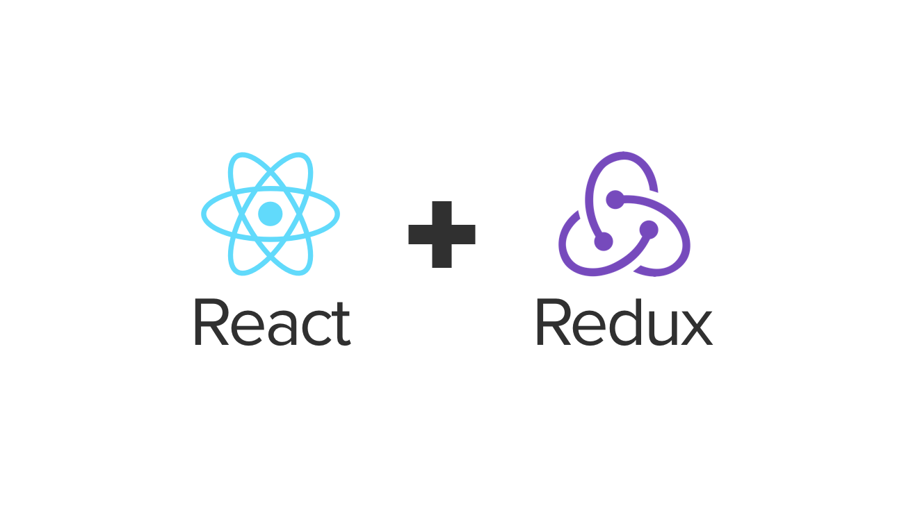
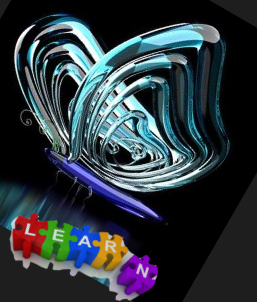
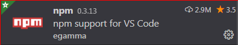
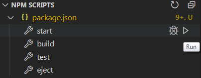
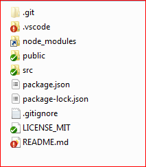
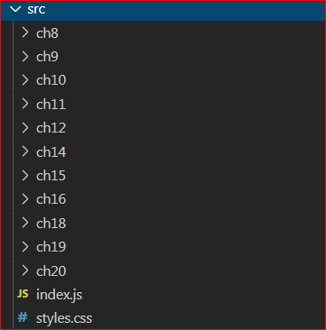
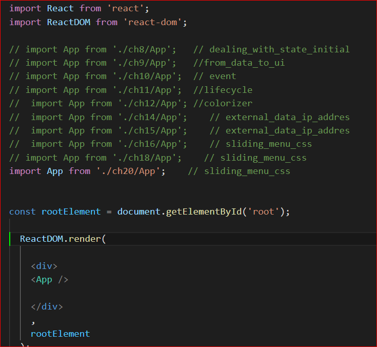

[source]: Hello

<p align="middle" >
  <a href="https://reactjs.org/">
        
  </a>

 

</p>

<h1 align="center">
  <p>Examples for</p>
  A Hands-On Guide to Building Web Applications Using React and Redux by Kirupa Chinnathambi 
</h1>

<h3 align="center">
  <a href="#whats-in-this-document">Quickstart</a>
  <span> · </span>
  <a href="../../issues">Issues</a>
  <span> · </span>
  <a href="#-how-to-run-examples">How Run</a>
  <span> · </span>
  Support: <a href="https://discord.gg/2AXkgr">Discord</a>
  <span> & </span>
  <a href="https://t.me/elprg">Telegram</a>
</h3>

___

### Links on author resourses:

<h4 align="left">
    <ul>
        <li>
        
        <a href="https://www.amazon.com/Learning-React-Hands-Building-Applications/dp/013484355X"> - Book on Amazone</a>
        </li>
        <li>
        
        <a href="https://github.com/kirupa/kirupa"> - Kirupa GitHub</a>
        </li>
        <li>
        
        <a href="https://www.kirupa.com"> - Kirupa Web Site</a>
        </li>
      </ul>
  </h4>

<br/>


<code>
<p align='center'><em>Everyone underwent something that changed him </em> </p>

<p align='center'><b> Everyone has one’s own path throughout React ツ </b> </p>
</code>

<br/>


<h3 align="center">
  <!-- <p><em>Everyone underwent something that changed him</em></p>
  <p><em>Everyone has one’s own path throughout React ツ </em></p> -->
</h3>
<h2 align="center">
  I hope that the examples will help you to quickly learn the interesting and convenient React framework.
</h2>

**Examples :**
<p align="center"> 
  <a href="https://github.com/gatsbyjs/gatsby/blob/master/LICENSE">
    
  </a>

<a href="https://t.me/elprg" style="padding:10px">
    
  </a>
</p>

**React:**

<p align="center"> 
  <a href="https://www.npmjs.org/package/gatsby">
    
  </a>
  <a href="https://npmcharts.com/compare/gatsby?minimal=true">
    
  </a>
  <a href="https://npmcharts.com/compare/gatsby?minimal=true">
    
  </a>
</p>

## What’s In This Document
[](#whats-in-this-document)
- [Intruduction](#-Intruduction)
- [🚀 Fast start](#-fast-start)
- [🏗️ Build project](#️-start-or-build-examples)
- [⚛ How this repository is organized](#-how-this-repository-is-organized)
- [▶ How to run examples ](#-how-to-run-examples)
- [License](#license)
- [💜 Thanks](#-thanks)


## Intruduction
These examples are taken partly from the book, partly from the site indicated in the [links](#links-on-author-resourses) resourses above. 

| **Title**              | React Examples             |
| :--------------------- | :------------------------- |
| **Editor**             | ElPrg                      |
| **Language**           | React, JS                  |
| **Version**            | v 1.1.5                    |
| **Req. build modules** | node.js, npm, react_script |
| **Req. react_modules** | react, react_dom, reduxe   |
| **Release**            | 23 Aug 2020                |
| **License**            | MIT                        |

<br/>

### List of dependencies

file **package.json** :
  
  ```json
  ...
  
  "dependencies": {
    "react":          "^16.13.1",
    "react-dom":      "^16.13.1",
    "react-scripts":  "^3.4.3",
    "react-router-dom":"5.2.0",
    "react-redux":    "7.2.1",
    "redux":          "4.0.5"
  },

  ```
<br/>

## 🚀 Fast start

For fast start you should some steps:

1. **Install VSCode**
   It is amazing code editor best (imho) for JS coding
   
   Link [VSCode](https://code.visualstudio.com/)

   then Install extension " `npm` by egamma"
   <br/>
    
  
2. **Install Node.js**

   Link [Node.js](https://nodejs.org)
   Note : Node.js has npm 

3. **Next step it is install packages for JS by npm**

   Some cmnds when you open VSCode end then open Terminal ( "Ctrl+Shift+`")  :

   ```shell

   npm install -save react
   
   or

   npm i -save react

   npm uninstall react 

   or

   npm u react 

   ```

  You `must` install all requiriment packages for building project.
  After that in your project folder appear folder `node_modules`.

  ## Tip
   If you create many project in different folders you may create symbolic-link on `node_modules`.


## 🏗️ Start or Build examples

There is in left pane u can start from `npm` commands some scripts



### ⚛ How this repository is organized

The repository is organized as follows :
<br/><br/>

1. **Struct examples project**
 
  
  
  The picture shows the standard structure of the React project.
  <br/> 
  Note: `node_modules` is symbolic_link ...
  

2. **Struct of `src` project**


<br/>

Note: I started with chapter 8, because the previous chapters I did the same as the author's (i.e. in the style of one playground file), and made updates for the new version of `react`, but I will post them a little later either in this repo or in a separate one.If someone `urgently` needs it, write in a personal.
<br/><br/>

### ▶ How to `run` examples 
<br/>
<p align="center">

</p>

In order to start some of the examples of the corresponding chapter, you need to uncomment one of the lines of the form :

  ```JS
    
  import App from './ch20/App';    // sliding_menu_css
      
  ```

and then [start npm](#️-start-or-build-examples)  script !!!

***In the first approximation, this seems to be all that needs to be done. Good luck! If that write me!***

## License

Licensed under the [MIT License](./LICENSE_MIT).

## 💜 Thanks

Thanks to :
- Kirupa Chinnathambi;
- React developres;
- Wife, Mame ... :)